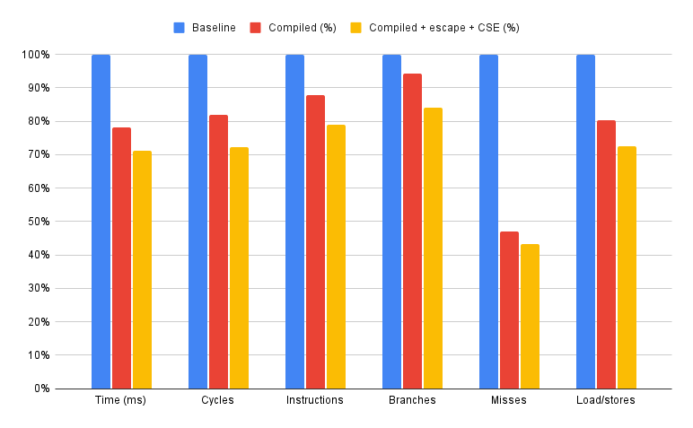

# Lightstorm

Simplified version of [Firestorm](https://www.youtube.com/watch?v=NfMX-dFMSr0) targeting C instead of machine code directly.

You can find more details about our approach in this blog post: [Lightstorm: minimalistic Ruby compiler](TBD).

Depending on the workload, lightstorm can significantly speedup the existing code.
Here is an example of speedups observed for [aobench](https://openbenchmarking.org/test/pts/aobench) benchmark.
The compiled version (rightmost) decreases total execution time by nearly ~30%.



## Development Setup

You can either use a [codespace](https://docs.github.com/en/codespaces/getting-started/quickstart) or a [devcontainer](https://code.visualstudio.com/docs/devcontainers/containers). For a local setup, follow the steps below.

### Install Dependencies

You need `ninja`, `cmake` (at least 3.28) and `llvm` 19.

On macOS:

```bash
brew install ninja cmake hyperfine llvm@19
```

On Ubuntu:

```bash
sudo apt-get install ninja-build cmake
```

To install LLVM 19 follow the instructions [here](https://apt.llvm.org).

### Checkout

```bash
git clone git@github.com:DragonRuby/lightstorm.git --recursive
```

## Hello World

### Build lightstorm binaries/runtime

```bash
# On Ubuntu
cmake --workflow --preset lightstorm-ubuntu-install
# On macOS
cmake --workflow --preset lightstorm-macos-install
```

### Compile and run "Hello World" program

```bash
> echo 'puts "Hello, Lightstorm"' > hello.rb
> ./install.dir/bin/lightstorm hello.rb -o hello.rb.c
> clang hello.rb.c -o hello_lightstorm \
  -L./install.dir/lib/ \
  -isystem./third_party/mruby/include -isystem./third_party/mruby/build/host/include/ \
   -llightstorm_runtime_main -llightstorm_mruby -lm
> ./hello_lightstorm
Hello, Lightstorm
```

## Build and run tests

Build a test (`tests/integration/loads.rb`):

```bash
> cd build.dir
> ninja loads.rb.exe
> ../tests/integration/Output/loads.rb.tmp.exe
1
-1
42
-42
1000
-1000
1000000
-1000000

42.0
a string 42
true
false
main
hello
[:a_sym]
```

Run integration tests

```bash
pip install lit filecheck
ninja run-integration-tests
```

Run benchmarks

```bash
ninja run-benchmarks
```

## License

Lightstorm is released under MIT license.

Licenses from dependencies can be found in `open-source-licenses.txt`.
